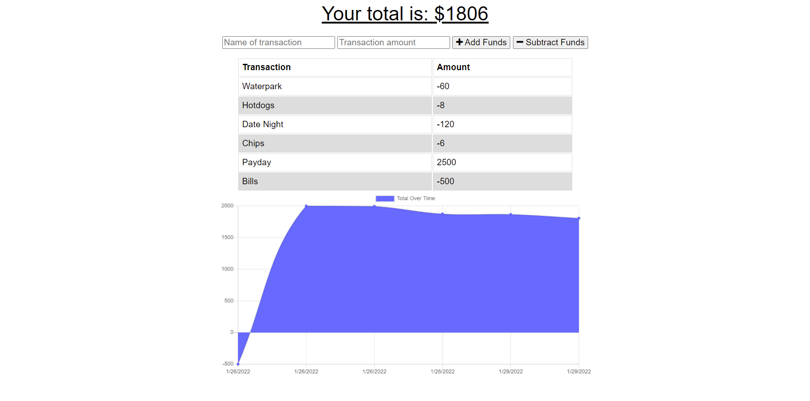

# budgetTracker_IJ
## Description
A wesbite for tracking your finances. The website allows for adding data  when offline, which will be added to the online database when the page reconnects.

## Table of Contents
- [Installation](#installation)
- [Usage](#usage)
- [Link and Screenshots](#link-and-screenshots)
- [Questions](#questions)

## Installation
The applications uses compression, express, lite-server, mongoose and morgan packages.

## Usage
Fill in the name of the transaction and total related to the transaction, then choose 'add funds' or 'subtract funds' to change the total and add data to the graph below.

## Link and Screenshots
Here is a link to the [deployed site](https://budget-tracker-ij.herokuapp.com/)

## Questions
You can find me on [Github](https://github.com/IsaacJCarnes)

  

